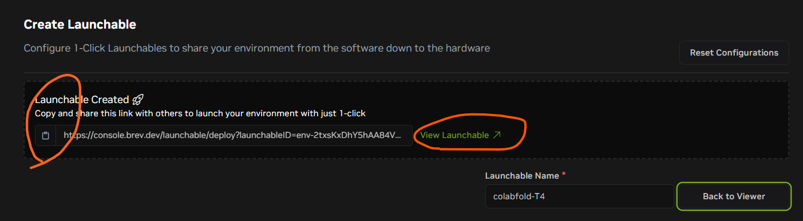

# Tutorial_ColabFold_Brev
A step-by-step tutorial for deploying the Jupyter Notebook
[ColabFold v1.5.5: AlphaFold2 using MMseqs2](https://colab.research.google.com/github/sokrypton/ColabFold/blob/main/AlphaFold2.ipynb) on NVIDIA Brev.

### Adavantages of running on Brev
- Brev provides a wide range of GPU types, from older generations like the T4 to advanced ones like the H100. You can find compute configurations that meet your budget and performance goals.
- High-memory GPUs can predict structures for long sequences.
- More powerful GPUs give greater acceleration for structure inference and relaxation.

### Creat Brev Account
Create an account on Brev if you haven't already. You can do this by clicking the “Create an account” button in the top right corner of the [Brev Console](https://console.brev.dev/org/org-2tcmRZuGMBx9Wlh2bxmuIdGb6UN/environments).

### Create Launchable & Deploy Instance
- A "Launchable" is a template of setting up an instance.
- Open a web browser and go to [Brev Console](https://console.brev.dev/org/org-2tcmRZuGMBx9Wlh2bxmuIdGb6UN/environments).
    - Create an account on Brev if you haven't already. You can do this by clicking the “Create an account” button in the top right corner of the Console.
- Click "Launchables" tab in the top menu bar.  

- Click "Create Launchables".  

- Here, you can choose from a variety of GPU types for compute configurations.  
    Below, I have listed the two compute configurations I tested.  
    1. Click "compute" -> "T4" -> "16GiB GPU Memory | 1 GPU • 15GiB RAM • 4 CPUs | GCP • $0.68/hr".  
    2. Click "compute" -> "A100" -> "40GiB GPU Memory | 1 GPU • 85GiB RAM • 12 CPUs | GCP • $4.86/hr".  
    Going forward, I'll use the T4 configuration as an example.  

- Type *100* under "Storage (GiB)", then click "Save Compute".  
    Note that for certain compute configurations, you cannot select a storage size below the allowed minimum. If, after entering the storage size, the "Save Compute" button does not become active, try adjusting the storage size.  

- Click "Container" -> Toggle the "Prestall Jupyter" switch to turn it on -> Click "VM Mode" box -> "Save Container". 

- Click "Files" -> Copy & paste the link to the tutorial Jupyter Notebook [AF2_mmseqs2_Brev.ipynb](AF2_mmseqs2_Brev.ipynb) -> Click "Add file".  

- Type under "Name Launchable", e.g., *colabfold-T4* -> Click "Generate Launchable". 
  

- Click "View Launchable".  
**Note that now you can copy & paste the link to this Launchable to share it with your friends, including all configurations such as compute, environment, and Jupyter Notebook, to make your work so much more reproducible.**  

- Click "Deploy Launchable".  

- Click "Go to Instance Page" when it becomes available and starts flashing.  

- You should now be on the instance page, as shown below.  
    - It might take a few minutes before you see the 'Running' status and button "Open Notebook" starts flashing.
    - Under the "Container" tab, you can view the log while your instance is being built.  

- Click on the "Open Notebook" button when it starts flashing.  

- You should now be directed to a Jupyter Lab that appears in your web browser. If it doesn’t load, try refreshing the page. 
Close up the benign error if it pops up.  
  
Double click the tutorial Jupyter Notebook `AF2_mmseqs2_Brev` in the left panel to open it up.  
  

- You're ready to run the tutorial Jupyter Notebook.  

### Delete Intance 
After you're done with your instance, make sure you go back to the Instances tab and click the "Delete" button. Otherwise, you'll keep burning your credits. The Instances tab shows all of your running instances.